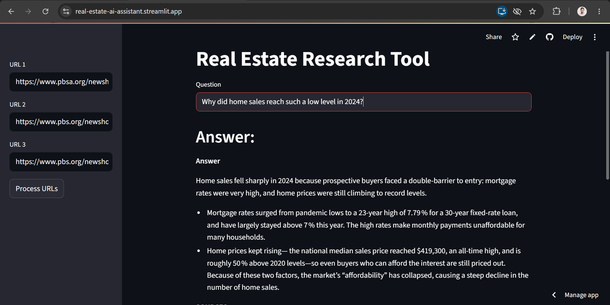
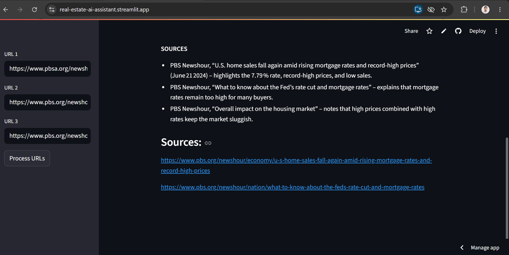

# Real Estate AI Assistant

An AI-powered Real Estate research assistant that uses **Retrieval-Augmented Generation (RAG)** to retrieve information from real-estate web pages and answer user questions based on the collected content.

## Live Demo

**Try the deployed application:**
https://real-estate-ai-assistant.streamlit.app/

## Project Overview

The Real Estate AI Assistant allows users to provide real-estate or news article URLs and ask questions about their content.

The application:

1. Loads content from the provided URLs
2. Splits the content into smaller chunks
3. Converts the chunks into embeddings
4. Stores the embeddings in ChromaDB
5. Retrieves relevant information for a user's question
6. Uses an LLM to generate an answer based on the retrieved content
7. Displays the sources used for the answer

## How It Works

```text
User
  ↓
Enter URLs
  ↓
Load Web Content
  ↓
Split Text into Chunks
  ↓
Generate Embeddings
  ↓
Chroma Vector Database
  ↓
Similarity Search
  ↓
Relevant Documents
  ↓
Groq LLM
  ↓
Answer + Sources
```

## Technologies & Modules

### Frontend

* Streamlit

### LLM & RAG

* LangChain
* LangChain Classic
* LangChain Community
* LangChain Groq
* LangChain HuggingFace
* Retrieval-Augmented Generation (RAG)

### Embeddings

* Sentence Transformers
* `thenlper/gte-small`

### Vector Database

* ChromaDB

### Web Data Loading

* UnstructuredURLLoader

### LLM

* Groq
* `openai/gpt-oss-20b`

### Programming & Configuration

* Python
* python-dotenv

## Features

* Accepts multiple web URLs
* Extracts information from web pages
* Splits content into meaningful chunks
* Creates vector embeddings
* Stores documents in ChromaDB
* Retrieves relevant information using similarity search
* Generates answers using an LLM
* Displays source URLs
* Simple Streamlit interface

## Project Structure

```text
Real_Estate_AI_Assistant/
│
├── main.py
├── rag.py
├── prompt.py
├── requirements.txt
├── .env
│
├── resources/
│   └── vectorstore/
│
├── screenshots/
│   ├── project.png
│   └── result.png
│
└── README.md
```

## Project Screenshots




## Installation

Clone the repository:

```bash
git clone https://github.com/rschaurasiya/Real_Estate_AI_Assistant.git
cd Real_Estate_AI_Assistant
```

Install the required dependencies:

```bash
pip install -r requirements.txt
```

## Environment Variables

Create a `.env` file and add your Groq API key:

```env
GROQ_API_KEY=your_groq_api_key
```

For Streamlit Cloud deployment, add the API key through the application's **Secrets** settings instead of committing the `.env` file.

## Run Locally

Start the Streamlit application:

```bash
streamlit run main.py
```

The application will open in your browser.

## Example Questions

After adding a suitable URL, you can ask questions such as:

* What is the current mortgage rate?
* What factors are affecting the housing market?
* What does the article say about home prices?
* What are the main points discussed in the article?

## Key Learning

This project helped me understand how to build a practical **RAG application** using:

* Document loading
* Text splitting
* Embeddings
* Vector databases
* Similarity search
* Prompt templates
* LLM-based question answering
* Source retrieval
* Streamlit deployment

## Author

**Radheshyam Kumar Chaurasiya**

B.Tech CSE Student | Data Science & AI

GitHub: https://github.com/rschaurasiya
